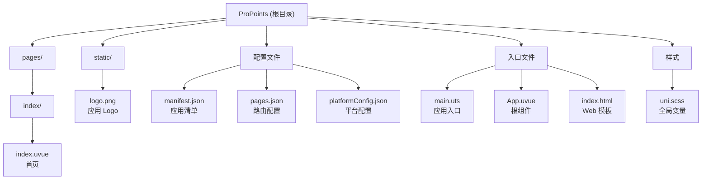

# ProPoints - 专业积分管理系统

## 项目愿景

ProPoints 是一个基于 uni-app X 框架开发的跨平台专业积分管理系统，旨在为用户提供便捷的积分管理体验。

## 技术栈概览

| 类别 | 技术 | 版本/说明 |
|------|------|----------|
| **框架** | uni-app X | DCloud 新一代跨平台框架 |
| **语言** | UTS (UniScript) | TypeScript 超集，编译为原生代码 |
| **视图** | Vue 3 | 组合式 API / SSR 支持 |
| **样式** | SCSS | 内置变量系统 |
| **目标平台** | Android | 主要目标（可扩展 iOS/Web/小程序） |
| **开发工具** | HBuilderX | DCloud 官方 IDE |
| **版本控制** | Git | 已初始化本地仓库 |

## 架构总览



## 模块索引

| 模块 | 路径 | 职责 | 状态 | 文档 |
|------|------|------|------|------|
| 首页 | `pages/index/` | 应用启动页与主界面 | 模板初始化 | [CLAUDE.md](./pages/index/CLAUDE.md) |

> 注：当前项目为初始化状态，仅包含框架模板代码，尚未开发业务模块。

## 目录结构

```
ProPoints/
├── .claude/                  # AI 上下文索引
│   └── index.json            # 项目结构索引
├── .git/                     # Git 版本控制
├── pages/                    # 页面目录
│   └── index/
│       ├── index.uvue        # 首页组件
│       └── CLAUDE.md         # 模块文档
├── static/                   # 静态资源
│   └── logo.png              # 应用 Logo
├── App.uvue                  # 根组件（生命周期管理）
├── main.uts                  # 应用入口
├── index.html                # Web 平台入口
├── manifest.json             # 应用清单配置
├── pages.json                # 页面路由配置
├── platformConfig.json       # 平台目标配置
├── uni.scss                  # 全局 SCSS 变量
└── CLAUDE.md                 # 项目文档（本文件）
```

## 全局开发规范

### 文件命名

- **页面文件**：使用小写字母，放置于 `pages/[模块名]/` 目录
- **组件文件**：使用 PascalCase，放置于 `components/` 目录（待创建）
- **工具函数**：使用 camelCase，放置于 `utils/` 目录（待创建）

### 代码风格

- 使用 UTS 语言编写逻辑，遵循 TypeScript 规范
- Vue 组件使用 Options API 或 Composition API
- 样式使用 SCSS，复用 `uni.scss` 定义的变量

### 平台条件编译

```typescript
// #ifdef APP-ANDROID
// Android 专属代码
// #endif

// #ifdef APP-ANDROID || APP-HARMONY
// Android 或鸿蒙专属代码
// #endif
```

### SCSS 变量速查

```scss
// 主题色
$uni-color-primary: #007aff;
$uni-color-success: #4cd964;
$uni-color-warning: #f0ad4e;
$uni-color-error: #dd524d;

// 文字
$uni-text-color: #333;
$uni-text-color-grey: #999;
$uni-font-size-base: 14px;
$uni-font-size-lg: 16px;

// 背景与边框
$uni-bg-color: #ffffff;
$uni-bg-color-grey: #f8f8f8;
$uni-border-color: #c8c7cc;

// 间距
$uni-spacing-row-base: 10px;
$uni-spacing-col-base: 8px;
```

## 快速入门

### 环境要求

1. 安装 [HBuilderX](https://www.dcloud.io/hbuilderx.html)（推荐最新正式版）
2. 安装 Android SDK（用于 Android 开发）

### 运行项目

1. 使用 HBuilderX 打开项目目录
2. 菜单：运行 -> 运行到手机或模拟器 -> 选择设备
3. 等待编译完成，应用将自动安装到设备

### 添加新页面

1. 在 `pages/` 下创建新目录和 `.uvue` 文件
2. 在 `pages.json` 中注册页面路由
3. 使用 `uni.navigateTo()` 进行页面跳转

### Git 操作

```bash
# 查看状态
git status

# 提交变更
git add .
git commit -m "描述变更内容"

# 配置远程仓库（待配置）
git remote add origin <远程仓库URL>
git push -u origin main
```

## 配置说明

### manifest.json

应用核心配置，包含：
- `name`: 应用名称（当前：ProPoints）
- `appid`: DCloud AppID（发布前需申请）
- `versionName`/`versionCode`: 版本信息（当前：1.0.0 / 100）
- 各平台特定配置（微信小程序 appid 等）

### pages.json

页面路由配置，包含：
- `pages`: 页面列表（第一项为启动页）
- `globalStyle`: 全局样式配置
- `tabBar`: 底部导航栏配置（如需要）

### platformConfig.json

开发时的目标平台配置，当前设为 `APP-ANDROID`。

## AI 使用指引

### 代码生成建议

- 生成页面时，遵循 `pages/[模块名]/[页面名].uvue` 结构
- 使用项目已有的 SCSS 变量（`$uni-color-primary` 等）
- 注意平台差异，必要时使用条件编译

### 常用 API 参考

- 页面跳转：`uni.navigateTo()`, `uni.redirectTo()`, `uni.switchTab()`
- 数据存储：`uni.setStorageSync()`, `uni.getStorageSync()`
- 网络请求：`uni.request()`
- UI 反馈：`uni.showToast()`, `uni.showModal()`

### 文档资源

- [uni-app X 官方文档](https://doc.dcloud.net.cn/uni-app-x/)
- [UTS 语言指南](https://doc.dcloud.net.cn/uni-app-x/uts/)
- [组件库](https://doc.dcloud.net.cn/uni-app-x/component/)

---

## 变更记录 (Changelog)

| 日期 | 版本 | 变更内容 |
|------|------|----------|
| 2025-12-12 | 1.0.2 | 增量扫描：确认源代码无变更，项目结构稳定 |
| 2025-12-12 | 1.0.1 | 增量更新：确认 Git 仓库初始化，更新目录结构，添加 SCSS 变量速查 |
| 2025-12-12 | 1.0.0 | 初始化项目文档，完成架构扫描 |
